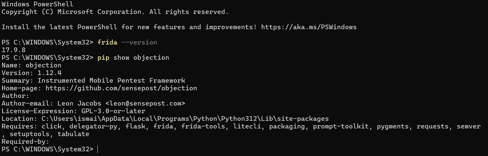
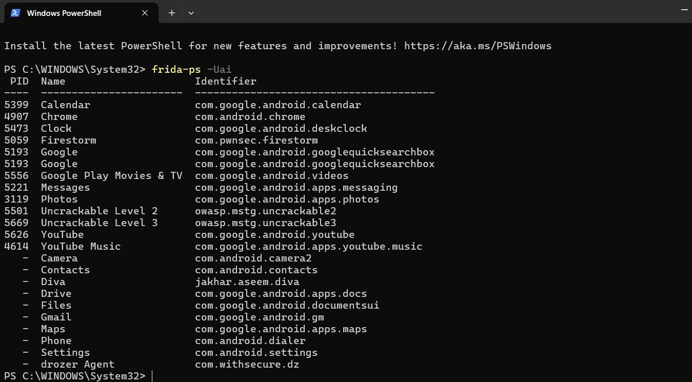
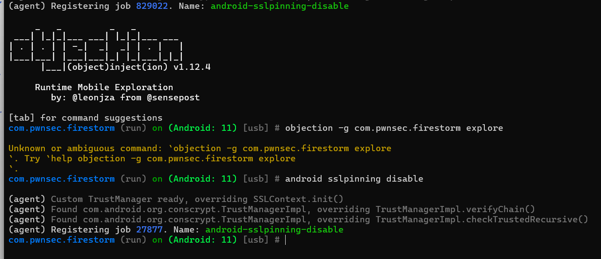

# Lab_16_MobileSecurity
# Inspection HTTPS Android : Desactivation du SSL Pinning avec Objection

## Objectif
Desactiver la protection SSL Pinning sur une application Android pour permettre l interception de ses requetes reseau HTTPS.

## Context
L application cible (Firestorm) valide le certificat du serveur via SSL Pinning. Cela bloque les connexions si un certificat non officiel est utilise. Nous utilisons Frida et Objection pour contourner dynamiquement cette securite.

## Etapes essentielles

### 1. Verification des outils sur le PC
* **Explication** : Verifier que Frida et Objection sont bien installes et operationnels sur la machine de test.
* **Action** : Execution des commandes de verification des versions dans le terminal.
* **Capture** : 

### 2. Demarrage du frida-server sur le telephone
* **Explication** : Configurer et executer le serveur Frida sur le peripherique Android pour permettre la communication avec le PC.
* **Action** : Push du binaire frida-server dans `/data/local/tmp`, attribution des permissions d execution et lancement en tache de fond. Verification de la visibilite de l appareil avec `frida-ps`.
* **Capture** : 

### 3. Injection et contournement avec Objection
* **Explication** : Ouvrir l application cible sous le controle d Objection pour injecter les scripts de desactivation du SSL Pinning.
* **Action** : Demarrage de la session Objection et execution de la commande de desactivation du pinning.
* **Capture** : 

### 4. Verification de la connexion
* **Explication** : Confirmer que l application continue de fonctionner normalement sans bloquer les connexions HTTPS.
* **Action** : Lancement d une requete reseau depuis l interface de l application Firestorm.
* **Capture** : 

## Resultat final
Le script d Objection a intercepte et modifie les reponses des classes TrustManager d Android au moment de l initialisation de la connexion. L application accepte desormais les requetes sans restriction de certificat.

## Conclusion
Le SSL Pinning protege l application contre l interception passive, mais reste vulnerable aux attaques par instrumentation dynamique. L utilisation combinee de Frida et d Objection permet de contourner cette protection sans modifier le code source de l application.
